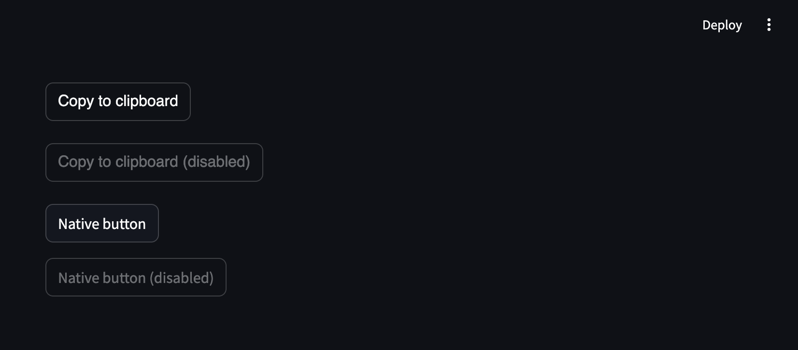

# streamlit-copy-to-clipboard

Streamlit component that allows you to copy text to clipboard.



## Installation instructions

```sh
pip install streamlit-copy-to-clipboard
```

## Usage instructions

```python
import streamlit as st

from streamlit_copy_to_clipboard import copy_to_clipboard

copy_to_clipboard(
    "Text to copy",
    label="Copy to clipboard",  # Optional
    label_after_copy="Copied!"  # Optional
)
```
